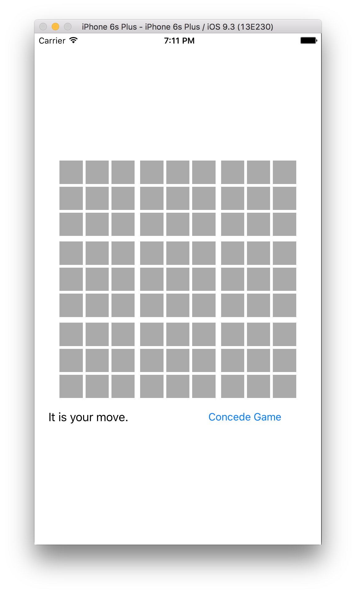
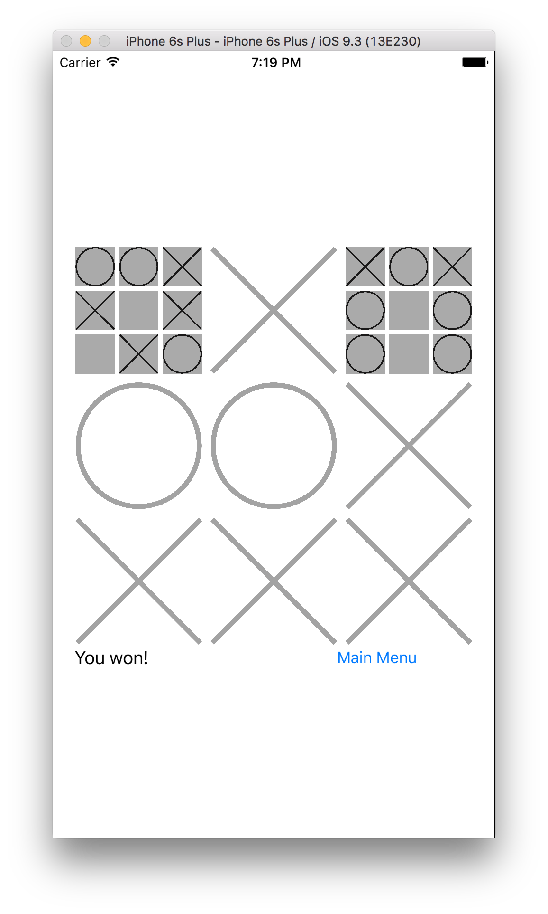

# Perfect-UltimateNaughtsAndCrosses

Ultimate Naughts &amp; Crosses game with Perfect backend

## The Project

This is a single &amp; multiplayer game created in Swift. The server uses Perfect as the backend. The focus of this project is on code sharing between the client and the server.

## The Game

**Ultimate Naughts &amp; Crosses (tic-tac-toe)**

Classic tic-tac-toe with two twists:

* Played on nine boards at once
* Can only make a move on board which corresponds to where the opponent last played

If a board is not available, the player can move on any open board. To win the game a player must win three boards in a row.

This adds strategy to a simple game: avoid easy wins by directing the opponent away from target boards.

 

## System Overview

This is a prototype. As such it makes several shortcuts which you would not find in a production system:

* It uses SQLite as the backend database
	* SQLite is good for example systems as there is no server to install and no configuration to be done, but it does not behave well in multi-user systems
* It uses simplistic numeric ids
	* Auto-incrementing numeric ids are easy to guess and thus spoof by attackers
* No user management
	* The system has no passwords or account recovery

That said, the system requires no installation or configuration and is suitable for an example click and run application.

## Project Creation

The provided Xcode workspace contains a ready to run project containing the iOS client project. The server is ready to be built with Swift Package Manager. If you wish to run the client and server together with Xcode, generate the server project with ```swift package generate-xcodeproj``` and drag the project file into the open workspace. Otherwise, the server can be built with ```swift build``` and run with the terminal command ```.build/debug/UNCServer```. The server will listen on port 8181 and the client will attempt to contact ```localhost:8181``` as the backend server.

## Shared Code

This project aims to share as much code as possible between the client and the server, thus illustrating the power of using Swift on the back-end for iOS development. All shared code is in the ```Sources/UNCShared``` directory. This consists mainly of structural elements &amp; protocols such as player piece types, API endpoints, serialization &amp; the game state interface as a whole.

## API Overview

The goal of the API is to support small, compact payloads. The current player id is set as an HTTP cookie. The data formats are simple strings of digits. Problems are indicated using HTTP error status codes. Most problems are indicated using the 400 "Bad request" code, with a more descriptive message given in the reponse body. A more sophisticated system may want to accept more complicated POST/GET requests and JSON response bodies, in addition to actual authentication mechanisms.

## Endpoints

Consult ```Sources/UNCShared/Endpoint.swift``` for the list of API elements. Here is a summary:

	* unc/register/{nick} - create new player
	* unc/start/{playertype} - start new game against a bot or player
	* unc/game - get meta-info on an active game
	* unc/concede - concede active game
	* unc/status - get full state of active game
	* unc/move/{bx}/{by}/{x}/{y} - bust a move
	* unc/nick/{playerid} - get opponent's nick

The server functions which register for these endpoint URLs are in ```Sources/UNCServer/Register.swift```.

The server includes a bot opponent which makes random moves.


